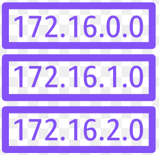
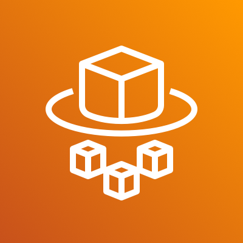
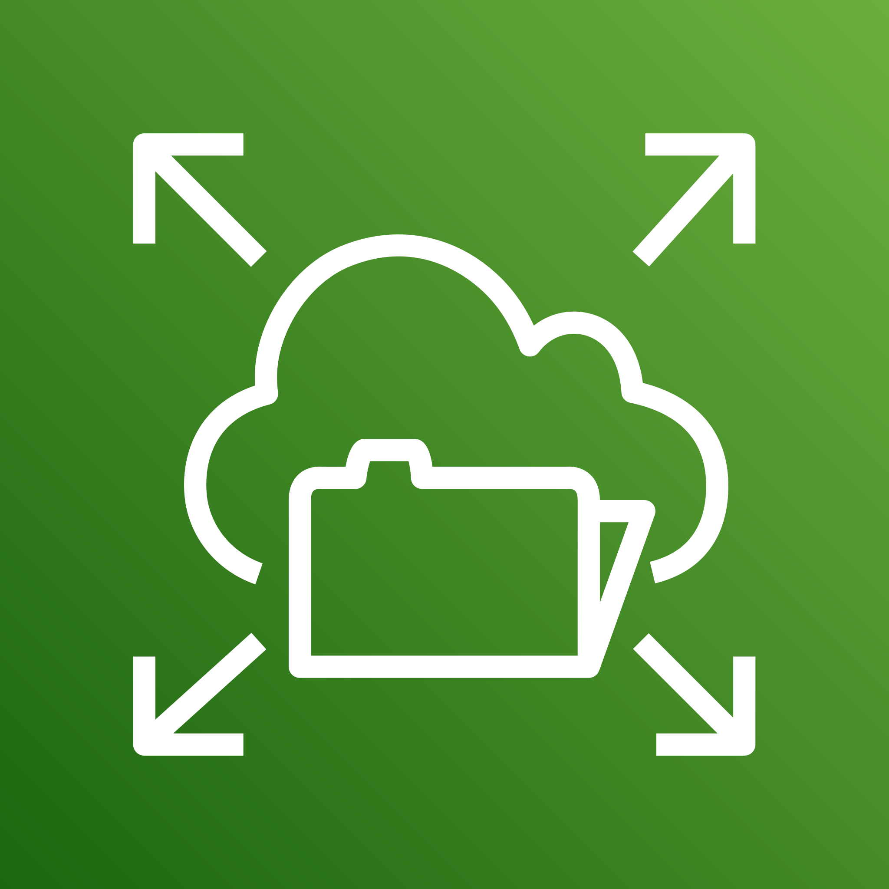
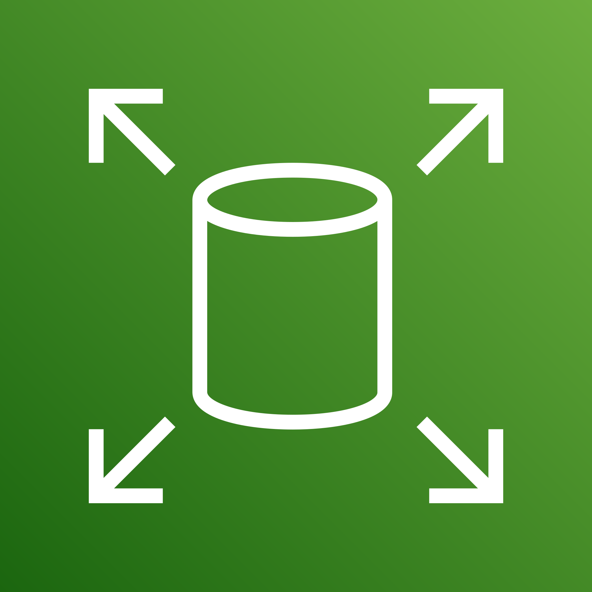
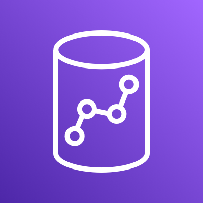
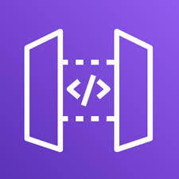
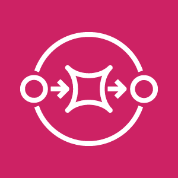

# Sami's Docs

Hi! I'm Sami Hamdalla, a computer science student at the University of Houston. I love learning about cloud technologies, software design, and solving challenging problems. This repo is where I document what I'm learning and keep my notes organized.

---

## Table of Contents

- [Cloud](#️cloud)
  - [AWS](#AWS)
  - [Azure](#Azure)
  - [Terraform](#terraform)
- [DevOps](#DevOps)
- [Object-Oriented Programming](#object-oriented-programming)
- [Data Structures & Algorithms](#data-structures--algorithms)
- [LeetCode Practice](#leetcode-practice)
- [Miscellaneous](#miscellaneous)

---

## Cloud
*Last updated: 04/13/2025*

### AWS

On 04/12/2025, I had the opportunity to attend my very first Cloudathon that introduced me to AWS. In preparation, I spent time learning fundamental AWS concepts such as identity management, compute, storage, and networking.

During the Cloudathon, I got hands-on experience working with real-world scenarios. I learned how to think critically about designing scalable and fault-tolerant architectures, and how various AWS services can be integrated to solve business problems.

We were given a problem statement that involved a company valued at over $10 million, operating in e-commerce, AdTech, and SaaS products had an on-prem architecture with a list of pain points. Our task was to migrate it to a cloud architecture.

Diving into it, I was confused on how to even begin. I decided to search up the most frequently used AWS services and begin from there. Here it is what I learned:

**Networking & Security**:

 **VPC (Virtual Private Cloud)** – Your own isolated section of the AWS cloud where you can launch resources in a logically separated network.

 **Subnets** – Divide your VPC into smaller networks. Use **public subnets** for internet-facing resources and **private subnets** for backend services.

 **Multi-AZ** – Deploy resources across multiple availability zones (data centers) for high availability and fault tolerance.

 **Internet Gateway (IGW)** – A gateway that allows communication between instances in your VPC and the internet (used by public subnets).

 **NAT Gateway** – Lets instances in a private subnet access the internet (for updates, API calls), without being exposed publicly.

 **Security Groups** – Virtual firewalls that control inbound and outbound traffic for your EC2 instances.

 **Network ACLs (NACLs)** – Stateless firewalls for subnets. Provide an extra layer of control over traffic in and out of a subnet.

 **Route Tables** – Define how traffic is directed within your VPC (e.g., send internet traffic through the IGW, private traffic to local subnets).

**Compute**:

 **EC2** – CPU, memory, storage, and networking capacity. A customizable virtual machine for running applications.

 **Lambda** – Run backend code without managing servers. Great for automation and microservices.

 **Fargate** – Run containers serverlessly without provisioning EC2. Works with ECS and EKS.

 **Auto Scaling** – Automatically adds or removes EC2s to match user demand.

**Storage**:

 **S3** – Scalable object storage. Use for files, backups, static websites, and data lakes.

 **EFS** – Network-attached storage you can mount to multiple EC2s.

 **EBS** – Block-level storage for EC2. Like a hard drive attached to your instance.

**Networking & Content Delivery**:

 **ALB (Application Load Balancer)** – Distributes incoming traffic across multiple targets (like EC2s).

 **CloudFront (CDN)** – Delivers content faster to users worldwide using edge locations.

 **Route 53** – AWS DNS service for routing users to your applications with high availability.

**Identity & Access**:

 **Cognito** – Adds user signup, sign-in, and access control to your apps.

 **IAM** – Manage who can access what in AWS (users, roles, policies).

**Databases**:

 **RDS** – Managed SQL databases (MySQL, PostgreSQL, etc.) without handling backups or patching.

 **Redshift** – Fast, petabyte-scale data warehouse for analytics.

**Monitoring & Logging**:

 **CloudWatch** – Monitor logs, metrics, and set alarms for all your AWS resources.

 **CloudTrail** – Logs all actions made through the AWS console or CLI. Great for auditing. **CloudWatch Alarms** – Set alerts when metrics (like CPU or errors) pass a threshold.

**API & Integration**:

 **API Gateway** – Creates REST or WebSocket APIs that connect frontend apps to Lambda or other services.

 **SQS** – Message queueing for decoupling components in distributed systems.

 **SNS** – Sends notifications via email, SMS, or HTTP endpoints (pub/sub model).


### Azure


### Terraform

During my time at ExxonMobil, I had the privilege of working with a powerful and emerging tool called **Terraform**. Terraform is an Infrastructure as Code (IaC) tool that enables cloud engineers to build, deploy, and manage cloud infrastructure using a simple, declarative language. It allows for scalable, version-controlled infrastructure deployments across cloud providers like AWS, Azure, and GCP.

#### Benefits of Terraform  

- **Infrastructure as Code (IaC):**  
  Terraform allows you to define and provision infrastructure using configuration files, enabling version control and automation.

- **Cloud-Agnostic:**  
  Terraform works with multiple cloud providers (AWS, Azure, GCP) and other platforms through a wide range of providers.

- **Declarative Configuration:**  
  You describe your desired infrastructure state, and Terraform determines the necessary steps to reach that state.

- **Execution Planning:**  
  The `terraform plan` command provides a preview of the changes Terraform will make before applying them, allowing for safer deployments.

- **Change Automation:**  
  Automatically applies incremental changes to infrastructure, minimizing the risk of manual errors.

- **State Management:**  
  Maintains a state file that maps your configuration to real-world infrastructure, ensuring accurate updates.

- **Modular Design:**  
  Enables code reuse and abstraction through modules, making infrastructure code more maintainable and scalable.

- **Collaboration Support:**  
  Teams can collaborate effectively by sharing infrastructure code through version control and using backends for remote state storage and locking.

- **Integration with CI/CD Pipelines:**  
  Easily integrates into DevOps workflows, enabling automated testing and deployment of infrastructure.

- **Policy and Governance (via TFE/TFC):**  
  Organizations can enforce security and compliance policies, manage users and permissions, and audit changes using Terraform Enterprise or Terraform Cloud.

**Core Components of Terraform:**
- **Providers**:
  - Plugins that interact with APIs of cloud platforms and services (AWS, Azure, GitHub). They define what infrastructure Terraform can manage.
  - ```hcl
    provider "aws" {
      region = "us-east-1"
    }
    ```
  - This tells Terraform to use the AWS provider and deploy resources in the us-east-1 region.
- **Resources**:
  - The basic building blocks in Terraform. Each resource corresponds to an infrastructure object (like an EC2 instance, a storage account, etc).
  - ```hcl
    resource "aws_s3_bucket" "my_bucket" {
      bucket = "my-unique-bucket-name"
      acl    = "private"
    }
    ```
  -  This defines an S3 bucket resource named my_bucket.

- **Modules**:
  - Self-contained packages of Terraform configurations. They help reuse code and organize complex infrastructure
  - ```hcl
    module "vpc" {
      source  = "./modules/vpc"
      cidr_block = "10.0.0.0/16"
    }
    ```
  - This calls a local VPC module and passes in a variable.
- **Variables**:
  - Inputs that allow configurations to be dynamic and reusable. Can be defined using variable blocks and passed via CLI, environment, or .tfvars files.
  - ```hcl
    variable "instance_type" {
      description = "EC2 instance type"
      type        = string
      default     = "t2.micro"
    }
    ```
  - You can override this value via CLI or `.tfvars` file.
- **Outputs**:
  - Values you want to extract from your Terraform configuration, useful for debugging or passing data between modules.
  - ```hcl
    output "bucket_name" {
      description = "Name of the S3 bucket"
      value       = aws_s3_bucket.my_bucket.bucket
    }
    ```
  - Used to display values after `terraform apply`.
- **State**:
  - Terraform uses a state file (terraform.tfstate) to map real-world infrastructure to your config. This file is critical for tracking changes and performing updates efficiently
  - Sometimes this is stored in storage on cloud if Terraform open source is used. This is done to ensure everyone is using the same version of the state file.
  - ```hcl
    terraform {
      backend "s3" {
        bucket         = "my-terraform-state-bucket"
        key            = "prod/terraform.tfstate"
        region         = "us-east-1"
        dynamodb_table = "terraform-locks"
        encrypt        = true
      }
    }
    ```
  - This example stores your state in an S3 bucket with state locking via DynamoDB.

- **Backend**:
  - Defines how and where Terraform stores its state. Common backends include local, S3 with DynamoDB locking, Azure Storage Account, or remote via Terraform Cloud. (Mentioned in state section).
- Lifecycle Rules:
  - Allow for finer control of resource behavior, such as create_before_destroy, ignore_changes, etc.
  - ```hcl
    resource "aws_instance" "web" {
      ami           = "ami-0c55b159cbfafe1f0"
      instance_type = var.instance_type
    
      lifecycle {
        create_before_destroy = true
        ignore_changes        = [tags]
      }
    }
    ```
  - Helps control how Terraform handles updates to resources.
- **Data Sources**:
  - Used to fetch information from providers (e.g., get the latest AMI ID from AWS) without creating new resources.
  - ```hcl
    data "aws_ami" "latest_amazon_linux" {
      most_recent = true
      owners      = ["amazon"]
    
      filter {
        name   = "name"
        values = ["amzn2-ami-hvm-*-x86_64-gp2"]
      }
    }
    ```
  - This fetches the latest Amazon Linux 2 AMI ID.


---
## DevOps
*Last updated: 04/13/2025*


---
## Object-Oriented Programming
*Last updated: 04/13/2025*


---

## Data Structures & Algorithms
*Last updated: 04/13/2025*

---

## LeetCode Practice
*Last updated: 04/13/2025*


---

## Miscellaneous
*Last updated: 04/13/2025*

---

