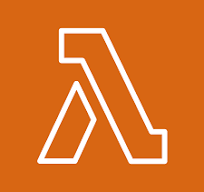

# Sami's Docs

Hi! I'm Sami Hamdalla, a computer science student at the University of Houston. I love learning about cloud technologies, software design, and solving challenging problems. This repo is where I document what I'm learning and keep my notes organized.

---

## Table of Contents

- [Cloud](#️cloud)
  - [AWS](#AWS)
  - [Azure](#Azure)
  - [Terraform](#terraform)
- [DevOps](#DevOps)
- [Object-Oriented Programming](#object-oriented-programming)
- [Data Structures & Algorithms](#data-structures--algorithms)
- [LeetCode Practice](#leetcode-practice)
- [Miscellaneous](#miscellaneous)

---

## Cloud
*Last updated: 04/13/2025*

### AWS

On 04/12/2025, I had the opportunity to attend my very first Cloudathon that introduced me to AWS. In preparation, I spent time learning fundamental AWS concepts such as identity management, compute, storage, and networking.

During the Cloudathon, I got hands-on experience working with real-world scenarios. I learned how to think critically about designing scalable and fault-tolerant architectures, and how various AWS services can be integrated to solve business problems.

We were given a problem statement that involved a company valued at over $10 million, operating in e-commerce, AdTech, and SaaS products had an on-prem architecture with a list of pain points. Our task was to migrate it to a cloud architecture.

Diving into it, I was confused on how to even begin. I decided to search up the most frequently used AWS services and begin from there. Here it is what I learned:

**Networking & Security**:
| Service | Icon | Description + Example |
|---------|-------|------------------------|
| VPC |  | A **Virtual Private Cloud** is your own logically isolated network in AWS. You control subnets, IP ranges, route tables, gateways, and firewall rules. <br>**Example:** Set up a VPC with private subnets for databases and public subnets for web servers to simulate a traditional data center setup. |
| Subnets |  | Subnets divide your VPC into smaller segments. Public subnets connect to the internet; private subnets do not. <br>**Example:** Place your ALB in a public subnet and your EC2 backend in a private subnet. |
| Multi-AZ |  | Multi-AZ means deploying instances in different physical data centers (Availability Zones) to increase fault tolerance. <br>**Example:** Host your app in 2 AZs so it stays online even if one fails. |
| Internet Gateway |  | An IGW connects public subnets to the internet. Without it, resources in your VPC cannot send/receive internet traffic. <br>**Example:** Your web server needs this to be accessible from users’ browsers. |
| NAT Gateway |  | A NAT Gateway lets private subnet resources reach the internet (for updates, API calls), but prevents inbound access. <br>**Example:** An EC2 in a private subnet installs security patches without exposing itself. |
| Security Groups |  | Acts as a virtual firewall at the EC2 level. It is stateful and controls what traffic is allowed in or out of a specific resource. <br>**Example:** Allow only ports 22 and 443 for SSH and HTTPS on your Linux EC2. |
| Network ACLs |  | Optional stateless firewall rules applied at the subnet level. You can use it for deny rules or IP blocking. <br>**Example:** Block an IP range that's scanning your subnet using an inbound NACL rule. |
| Route Tables |  | Define how traffic flows within your VPC. Route public traffic to the IGW and internal traffic across subnets. <br>**Example:** Route app-tier traffic to database-tier using private IPs only. |

**Compute**:

| Service | Icon | Description + Example |
|---------|-------|------------------------|
| EC2 |  | Elastic Compute Cloud gives you full control over virtual machines in the cloud. You choose OS, instance type, and storage. <br>**Example:** Run a Python Flask server on an EC2 Linux instance with an EBS volume. |
| Lambda |  | A serverless function that runs code without provisioning servers. It executes only when triggered, saving cost. <br>**Example:** Automatically resize images uploaded to S3 without managing any server. |
| Fargate |  | Serverless compute engine for running containers. You don’t manage EC2 or clusters. Works with ECS or EKS. <br>**Example:** Deploy a containerized Flask app with zero server management. |
| Auto Scaling |  | Automatically increases or decreases EC2 instances based on demand, health checks, or schedules. <br>**Example:** During high traffic hours, scale up EC2s behind a load balancer; scale down at night. |

**Storage**:

| Service | Icon | Description + Example |
|---------|-------|------------------------|
| S3 |  | Simple Storage Service offers highly scalable object storage for files, backups, and static websites. <br>**Example:** Host a React app’s static files and images in a public S3 bucket. |
| EFS |  | Elastic File System is a shared POSIX-compliant file system for use with Linux EC2 instances. <br>**Example:** Mount a shared file directory across a fleet of EC2s running the same app. |
| EBS |  | Elastic Block Store provides raw block-level storage that you can attach to EC2 like a hard disk. <br>**Example:** Store a database on a persistent EBS volume attached to your EC2. |


**Networking & Content Delivery**:

| Service | Icon | Description + Example |
|---------|-------|------------------------|
| ALB |  | Application Load Balancer routes HTTP(S) traffic to targets like EC2, Lambda, or containers. Supports path-based and host-based routing. <br>**Example:** Route `/api` traffic to EC2 and `/auth` traffic to Lambda. |
| CloudFront |  | Content Delivery Network that caches static and dynamic content in edge locations globally. <br>**Example:** Deliver a website’s media and assets faster to international users. |
| Route 53 |  | DNS service that routes traffic globally. Supports domain registration, health checks, and failover. <br>**Example:** Register `example.com` and route it to your ALB with latency-based routing. |


**Identity & Access**:

| Service | Icon | Description + Example |
|---------|-------|------------------------|
| Cognito |  | User identity management service with login/signup, OAuth, and MFA. Integrates with mobile/web apps. <br>**Example:** Add Google login and user pools to a React app with Cognito. |
| IAM |  | Identity and Access Management lets you define users, roles, groups, and policies to control access. <br>**Example:** Create a role that lets EC2 access only specific S3 buckets. |


**Databases**:

| Service | Icon | Description + Example |
|---------|-------|------------------------|
| RDS |  | Managed relational database service for MySQL, PostgreSQL, and more. Includes backups, patching, and Multi-AZ support. <br>**Example:** Deploy a PostgreSQL DB for your web app with auto failover enabled. |
| Redshift |  | Petabyte-scale data warehouse built for analytics and OLAP queries. Optimized for reporting. <br>**Example:** Run complex joins on billions of records from event logs or sales data. |


**Monitoring & Logging**:

| Service | Icon | Description + Example |
|---------|-------|------------------------|
| CloudWatch |  | Monitors resource usage, collects logs, creates dashboards, and sends alerts. <br>**Example:** Set up an alarm to notify when EC2 CPU > 80% for 5 minutes. |
| CloudTrail |  | Records every action taken through AWS Console, CLI, or SDK for auditing and compliance. <br>**Example:** See who deleted an S3 bucket by reviewing CloudTrail logs. |


**API & Integration**:

| Service | Icon | Description + Example |
|---------|-------|------------------------|
| API Gateway |  | Creates REST and WebSocket APIs. Easily connect frontend to Lambda, EC2, or backend services. <br>**Example:** Expose a Lambda-based backend via secure API endpoints. |
| SQS |  | Queueing system for decoupling microservices. Ensures reliable message delivery. <br>**Example:** Handle 10,000+ orders per minute without crashing the backend. |
| SNS |  | Pub/Sub notification system that pushes messages to email, SMS, Lambda, or other endpoints. <br>**Example:** Send an alert email when your database instance restarts. |


### Azure


### Terraform

During my time at ExxonMobil, I had the privilege of working with a powerful and emerging tool called **Terraform**. Terraform is an Infrastructure as Code (IaC) tool that enables cloud engineers to build, deploy, and manage cloud infrastructure using a simple, declarative language. It allows for scalable, version-controlled infrastructure deployments across cloud providers like AWS, Azure, and GCP.

#### Benefits of Terraform  

- **Infrastructure as Code (IaC):**  
  Terraform allows you to define and provision infrastructure using configuration files, enabling version control and automation.

- **Cloud-Agnostic:**  
  Terraform works with multiple cloud providers (AWS, Azure, GCP) and other platforms through a wide range of providers.

- **Declarative Configuration:**  
  You describe your desired infrastructure state, and Terraform determines the necessary steps to reach that state.

- **Execution Planning:**  
  The `terraform plan` command provides a preview of the changes Terraform will make before applying them, allowing for safer deployments.

- **Change Automation:**  
  Automatically applies incremental changes to infrastructure, minimizing the risk of manual errors.

- **State Management:**  
  Maintains a state file that maps your configuration to real-world infrastructure, ensuring accurate updates.

- **Modular Design:**  
  Enables code reuse and abstraction through modules, making infrastructure code more maintainable and scalable.

- **Collaboration Support:**  
  Teams can collaborate effectively by sharing infrastructure code through version control and using backends for remote state storage and locking.

- **Integration with CI/CD Pipelines:**  
  Easily integrates into DevOps workflows, enabling automated testing and deployment of infrastructure.

- **Policy and Governance (via TFE/TFC):**  
  Organizations can enforce security and compliance policies, manage users and permissions, and audit changes using Terraform Enterprise or Terraform Cloud.

**Core Components of Terraform:**
- **Providers**:
  - Plugins that interact with APIs of cloud platforms and services (AWS, Azure, GitHub). They define what infrastructure Terraform can manage.
  - ```hcl
    provider "aws" {
      region = "us-east-1"
    }
    ```
  - This tells Terraform to use the AWS provider and deploy resources in the us-east-1 region.
- **Resources**:
  - The basic building blocks in Terraform. Each resource corresponds to an infrastructure object (like an EC2 instance, a storage account, etc).
  - ```hcl
    resource "aws_s3_bucket" "my_bucket" {
      bucket = "my-unique-bucket-name"
      acl    = "private"
    }
    ```
  -  This defines an S3 bucket resource named my_bucket.

- **Modules**:
  - Self-contained packages of Terraform configurations. They help reuse code and organize complex infrastructure
  - ```hcl
    module "vpc" {
      source  = "./modules/vpc"
      cidr_block = "10.0.0.0/16"
    }
    ```
  - This calls a local VPC module and passes in a variable.
- **Variables**:
  - Inputs that allow configurations to be dynamic and reusable. Can be defined using variable blocks and passed via CLI, environment, or .tfvars files.
  - ```hcl
    variable "instance_type" {
      description = "EC2 instance type"
      type        = string
      default     = "t2.micro"
    }
    ```
  - You can override this value via CLI or `.tfvars` file.
- **Outputs**:
  - Values you want to extract from your Terraform configuration, useful for debugging or passing data between modules.
  - ```hcl
    output "bucket_name" {
      description = "Name of the S3 bucket"
      value       = aws_s3_bucket.my_bucket.bucket
    }
    ```
  - Used to display values after `terraform apply`.
- **State**:
  - Terraform uses a state file (terraform.tfstate) to map real-world infrastructure to your config. This file is critical for tracking changes and performing updates efficiently
  - Sometimes this is stored in storage on cloud if Terraform open source is used. This is done to ensure everyone is using the same version of the state file.
  - ```hcl
    terraform {
      backend "s3" {
        bucket         = "my-terraform-state-bucket"
        key            = "prod/terraform.tfstate"
        region         = "us-east-1"
        dynamodb_table = "terraform-locks"
        encrypt        = true
      }
    }
    ```
  - This example stores your state in an S3 bucket with state locking via DynamoDB.

- **Backend**:
  - Defines how and where Terraform stores its state. Common backends include local, S3 with DynamoDB locking, Azure Storage Account, or remote via Terraform Cloud. (Mentioned in state section).
- Lifecycle Rules:
  - Allow for finer control of resource behavior, such as create_before_destroy, ignore_changes, etc.
  - ```hcl
    resource "aws_instance" "web" {
      ami           = "ami-0c55b159cbfafe1f0"
      instance_type = var.instance_type
    
      lifecycle {
        create_before_destroy = true
        ignore_changes        = [tags]
      }
    }
    ```
  - Helps control how Terraform handles updates to resources.
- **Data Sources**:
  - Used to fetch information from providers (e.g., get the latest AMI ID from AWS) without creating new resources.
  - ```hcl
    data "aws_ami" "latest_amazon_linux" {
      most_recent = true
      owners      = ["amazon"]
    
      filter {
        name   = "name"
        values = ["amzn2-ami-hvm-*-x86_64-gp2"]
      }
    }
    ```
  - This fetches the latest Amazon Linux 2 AMI ID.


---
## DevOps
*Last updated: 04/13/2025*


---
## Object-Oriented Programming
*Last updated: 04/13/2025*


---

## Data Structures & Algorithms
*Last updated: 04/13/2025*

---

## LeetCode Practice
*Last updated: 04/13/2025*


---

## Miscellaneous
*Last updated: 04/13/2025*

---

