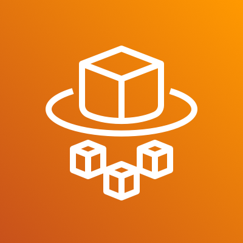
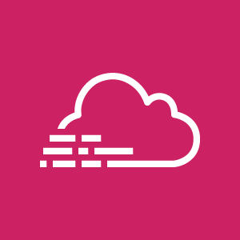

# AWS
_Last updated: 04/14/2025_
## Overview
- [Services](#services)
  - [Networking & Security](#networking--security)
  - [Compute](#compute)
  - [Storage](#storage)
  - [Networking & Content Delivery](#networking--content-delivery)
  - [Identity & Access](#identity--access)
  - [Databases](#databases)
  - [Monitoring & Logging](#monitoring--logging)
  - [API & Integration](#api--integration)
  - [CI/CD](#cicd)
- [Approach to Multi Tier Architecture](#approach-to-multi-tier-architecture)
  - [VPC & Subnets](#1-vpc--subnets---building-your-network-foundation)
    - [What is a VPC and Why Use It?](#what-is-a-vpc-and-why-use-it)
    - [Why Use Multiple Availability Zones?](#why-use-multiple-availability-zones)
    - [Subnet Design Philosophy](#subnet-design-philosophy)
  - [Gateways & Routing](#2-gateways--routing---controlling-traffic-flow)
    - [Internet Gateway (IGW)](#internet-gateway-igw)
    - [NAT Gateway](#nat-gateway)
    - [Route Tables](#route-tables---the-traffic-directors)
  - [Security Groups](#3-security-groups---your-firewall-rules)
    - [External ALB Security Group](#external-alb-security-group)
    - [Web Server Security Group](#web-server-security-group-web-tier-ec2)
    - [Internal ALB Security Group](#internal-alb-security-group)
    - [App EC2 Security Group](#app-ec2-security-group)
    - [DB Security Group](#db-security-group)
  - [Load Balancers](#4-load-balancers---distributing-traffic-and-ensuring-availability)
    - [External Application Load Balancer](#external-application-load-balancer-alb)
    - [Internal Application Load Balancer](#internal-application-load-balancer-alb)
    - [Target Groups](#target-groups---defining-where-traffic-gets-routed)
  - [Launch Templates](#5-launch-templates---defining-how-instances-are-created)
    - [Web Tier Launch Template](#web-tier-launch-template-frontend)
    - [App Tier Launch Template](#app-tier-launch-template-backend)
  - [Auto Scaling Groups](#6-auto-scaling-groups-asg---dynamic-resource-management)
    - [Web Tier ASG](#web-tier-asg-frontend)
    - [App Tier ASG](#app-tier-asg-backend)
  - [RDS](#7-rds---postgresql-database-tier)
  - [CI/CD Pipeline](#8-cicd-pipeline---automation-for-reliable-deployments)
    - [Services and Flow](#services-and-flow)
    - [Frontend Pipeline Flow](#frontend-react-pipeline-flow)
    - [Backend Pipeline Flow](#backend-express-pipeline-flow)
    - [Build Specifications](#codebuild--react-buildspecyml)
  - [CDN & DNS](#9-cdn--dns---global-content-delivery-and-routing)
    - [CloudFront CDN](#cloudfront-cdn)
    - [Route 53 DNS](#route-53-dns)
  - [Monitoring](#10-monitoring-and-alerting)
    - [CloudWatch](#cloudwatch)
    - [AWS X-Ray](#aws-x-ray)
  - [Final Architecture Summary](#final-architecture-summary)
- [Resources](#resources)


## Services

**Networking & Security**:
| Service | Icon | Description + Example |
|---------|-------|------------------------|
| VPC |  | A **Virtual Private Cloud** is your own logically isolated network in AWS. You control subnets, IP ranges, route tables, gateways, and firewall rules. <br>**Example:** Set up a VPC with private subnets for databases and public subnets for web servers to simulate a traditional data center setup. |
| Subnets |  | Subnets divide your VPC into smaller segments. Public subnets connect to the internet; private subnets do not. <br>**Example:** Place your ALB in a public subnet and your EC2 backend in a private subnet. |
| Multi-AZ |  | Multi-AZ means deploying instances in different physical data centers (Availability Zones) to increase fault tolerance. <br>**Example:** Host your app in 2 AZs so it stays online even if one fails. |
| Internet Gateway |  | An IGW connects public subnets to the internet. Without it, resources in your VPC cannot send/receive internet traffic. <br>**Example:** Your web server needs this to be accessible from users’ browsers. |
| NAT Gateway |  | A NAT Gateway lets private subnet resources reach the internet (for updates, API calls), but prevents inbound access. <br>**Example:** An EC2 in a private subnet installs security patches without exposing itself. |
| Security Groups |  | Acts as a virtual firewall at the EC2 level. It is stateful and controls what traffic is allowed in or out of a specific resource. <br>**Example:** Allow only ports 22 and 443 for SSH and HTTPS on your Linux EC2. |
| Network ACLs |  | Optional stateless firewall rules applied at the subnet level. You can use it for deny rules or IP blocking. <br>**Example:** Block an IP range that's scanning your subnet using an inbound NACL rule. |
| Route Tables |  | Define how traffic flows within your VPC. Route public traffic to the IGW and internal traffic across subnets. <br>**Example:** Route app-tier traffic to database-tier using private IPs only. |

**Compute**:

| Service | Icon | Description + Example |
|---------|-------|------------------------|
| EC2 |  | Elastic Compute Cloud gives you full control over virtual machines in the cloud. You choose OS, instance type, and storage. <br>**Example:** Run a Python Flask server on an EC2 Linux instance with an EBS volume. |
| Lambda |  | A serverless function that runs code without provisioning servers. It executes only when triggered, saving cost. <br>**Example:** Automatically resize images uploaded to S3 without managing any server. |
| Fargate |  | Serverless compute engine for running containers. You don’t manage EC2 or clusters. Works with ECS or EKS. <br>**Example:** Deploy a containerized Flask app with zero server management. |
| Auto Scaling |  | Automatically increases or decreases EC2 instances based on demand, health checks, or schedules. <br>**Example:** During high traffic hours, scale up EC2s behind a load balancer; scale down at night. |

**Storage**:

| Service | Icon | Description + Example |
|---------|-------|------------------------|
| S3 |  | Simple Storage Service offers highly scalable object storage for files, backups, and static websites. <br>**Example:** Host a React app’s static files and images in a public S3 bucket. |
| EFS |  | Elastic File System is a shared POSIX-compliant file system for use with Linux EC2 instances. <br>**Example:** Mount a shared file directory across a fleet of EC2s running the same app. |
| EBS |  | Elastic Block Store provides raw block-level storage that you can attach to EC2 like a hard disk. <br>**Example:** Store a database on a persistent EBS volume attached to your EC2. |


**Networking & Content Delivery**:

| Service | Icon | Description + Example |
|---------|-------|------------------------|
| ALB |  | Application Load Balancer routes HTTP(S) traffic to targets like EC2, Lambda, or containers. Supports path-based and host-based routing. <br>**Example:** Route `/api` traffic to EC2 and `/auth` traffic to Lambda. |
| CloudFront |  | Content Delivery Network that caches static and dynamic content in edge locations globally. <br>**Example:** Deliver a website’s media and assets faster to international users. |
| Route 53 |  | DNS service that routes traffic globally. Supports domain registration, health checks, and failover. <br>**Example:** Register `example.com` and route it to your ALB with latency-based routing. |


**Identity & Access**:

| Service | Icon | Description + Example |
|---------|-------|------------------------|
| Cognito |  | User identity management service with login/signup, OAuth, and MFA. Integrates with mobile/web apps. <br>**Example:** Add Google login and user pools to a React app with Cognito. |
| IAM |  | Identity and Access Management lets you define users, roles, groups, and policies to control access. <br>**Example:** Create a role that lets EC2 access only specific S3 buckets. |


**Databases**:

| Service | Icon | Description + Example |
|---------|-------|------------------------|
| RDS |  | Managed relational database service for MySQL, PostgreSQL, and more. Includes backups, patching, and Multi-AZ support. <br>**Example:** Deploy a PostgreSQL DB for your web app with auto failover enabled. |
| Redshift |  | Petabyte-scale data warehouse built for analytics and OLAP queries. Optimized for reporting. <br>**Example:** Run complex joins on billions of records from event logs or sales data. |


**Monitoring & Logging**:

| Service | Icon | Description + Example |
|---------|-------|------------------------|
| CloudWatch |  | Monitors resource usage, collects logs, creates dashboards, and sends alerts. <br>**Example:** Set up an alarm to notify when EC2 CPU > 80% for 5 minutes. |
| CloudTrail |  | Records every action taken through AWS Console, CLI, or SDK for auditing and compliance. <br>**Example:** See who deleted an S3 bucket by reviewing CloudTrail logs. |


**API & Integration**:

| Service | Icon | Description + Example |
|---------|-------|------------------------|
| API Gateway |  | Creates REST and WebSocket APIs. Easily connect frontend to Lambda, EC2, or backend services. <br>**Example:** Expose a Lambda-based backend via secure API endpoints. |
| SQS |  | Queueing system for decoupling microservices. Ensures reliable message delivery. <br>**Example:** Handle 10,000+ orders per minute without crashing the backend. |
| SNS |  | Pub/Sub notification system that pushes messages to email, SMS, Lambda, or other endpoints. <br>**Example:** Send an alert email when your database instance restarts. |

## Approach to Multi Tier Architecture

On 04/12/2025, I had the opportunity to attend my very first Cloudathon that introduced me to AWS. In preparation, I spent time learning fundamental AWS concepts such as identity management, compute, storage, and networking.

During the Cloudathon, I got hands-on experience working with real-world scenarios. I learned how to think critically about designing scalable and fault-tolerant architectures, and how various AWS services can be integrated to solve business problems.

We were given a problem statement that involved a company valued at over $10 million, operating in e-commerce, AdTech, and SaaS products had an on-prem architecture with a list of pain points. Our task was to migrate it to a cloud architecture.

Diving into it, I was confused on how to even begin. I decided to search up the most frequently used AWS services and begin from there.


This document provides a detailed explanation of a production-grade AWS architecture for hosting a React frontend and Express API backend application, with comprehensive CI/CD pipeline integration and auto-scaling capabilities.

## 1. VPC & Subnets - Building Your Network Foundation

### What is a VPC and Why Use It?
A Virtual Private Cloud (VPC) provides an isolated section of the AWS cloud where you can launch resources in a defined virtual network. This isolation is crucial for security, allowing you to control exactly what traffic can enter and exit your application environment.

- **VPC CIDR**: `10.0.0.0/16` - This provides 65,536 IP addresses within your virtual network, giving ample room for all resources and future expansion.

### Why Use Multiple Availability Zones?
Using at least 2 Availability Zones (AZs) provides crucial redundancy. If one AZ experiences an outage, your application continues to run in the other AZ, ensuring high availability (99.99% uptime potential vs. 99.9% with a single AZ).

### Subnet Design Philosophy
The subnet layout follows a defense-in-depth approach, creating clear security boundaries between different application tiers:

| AZ | Subnet Name | CIDR | Type | Purpose |
|---|---|---|---|---|
| us-east-1a | Public Subnet A | 10.0.1.0/24 | Public | Hosts internet-facing resources like load balancers |
| us-east-1b | Public Subnet B | 10.0.2.0/24 | Public | Redundant subnet in a different AZ for high availability |
| us-east-1a | App Subnet A | 10.0.3.0/24 | Private | Protected environment for application servers |
| us-east-1b | App Subnet B | 10.0.4.0/24 | Private | Redundant subnet for application high availability |
| us-east-1a | DB Subnet A | 10.0.5.0/24 | Private | Highly protected environment for database servers |
| us-east-1b | DB Subnet B | 10.0.6.0/24 | Private | Redundant subnet for database high availability |

**Why this separation?**
- **Public subnets**: Only resources that require direct internet access are placed here (load balancers), minimizing attack surface.
- **App subnets**: Application servers are protected from direct internet access but can initiate outbound connections via NAT Gateway.
- **DB subnets**: Database is in the most protected tier, accessible only by the application tier, not directly from the internet.

## 2. Gateways & Routing - Controlling Traffic Flow

### Internet Gateway (IGW)
An Internet Gateway allows two-way communication between your VPC and the public internet. It's attached directly to your VPC and serves as the primary entry and exit point for internet traffic.

**Why use an IGW?** 
- Enables resources in public subnets to directly access the internet
- Allows internet users to access public-facing services like your load balancers
- Acts as a highly available and redundant component with no bandwidth constraints

### NAT Gateway
A Network Address Translation (NAT) Gateway enables resources in private subnets to initiate outbound connections to the internet, but prevents inbound connections from the internet.

**Why use a NAT Gateway?**
- Allows EC2 instances in private subnets to download updates and patches
- Enables API calls to external services from your application tier
- Prevents direct inbound access to your application servers, enhancing security
- Placed in Public Subnet A and associated with an Elastic IP for consistent addressing

### Route Tables - The Traffic Directors
Route tables contain rules (routes) that determine where network traffic is directed.

**Public Subnet Route Tables:**
- `0.0.0.0/0 → IGW`: All internet-bound traffic from public subnets is sent to the internet gateway
- Local route (10.0.0.0/16) for internal VPC communication is automatically created

**Private Subnet Route Tables (App and DB Subnets):**
- `0.0.0.0/0 → NAT Gateway`: All internet-bound traffic is routed through the NAT Gateway
- Local route (10.0.0.0/16) for internal VPC communication

**Why this routing configuration?**
- Ensures private resources cannot be directly accessed from the internet
- Maintains ability to perform updates and access external services from private resources
- Creates a clear network boundary between internet-facing and internal resources

## 3. Security Groups - Your Firewall Rules

Security Groups act as virtual firewalls that control inbound and outbound traffic at the instance level. They are stateful, meaning if you allow an inbound connection, the response is automatically allowed out.

### External ALB Security Group
- **Inbound**: 80/443 from 0.0.0.0/0 (HTTP/HTTPS from anywhere)
- **Outbound**: All traffic

**Why?** This SG must accept incoming web traffic from any internet user while maintaining the ability to route traffic to internal resources.

### Web Server Security Group (Web Tier EC2)
- **Inbound**: 80/443 only from External ALB SG
- **Outbound**: All traffic

**Why?** Web servers should only accept traffic that has been properly routed through the external load balancer, adding a crucial security layer for your public-facing servers.

### Internal ALB Security Group
- **Inbound**: 3000 (React build) or 5000 (Express API) only from External ALB SG
- **Outbound**: All traffic

**Why?** The internal ALB should only accept traffic that has been properly routed through the external load balancer, creating a security boundary.

### App EC2 Security Group
- **Inbound**: 3000 or 5000 only from Internal ALB SG
- **Outbound**: 5432 to DB SG, plus general internet access via NAT

**Why?** Application servers should only accept traffic from the load balancer, and should only communicate with the database on the specific PostgreSQL port.

### DB Security Group
- **Inbound**: 5432 only from App EC2 SG
- **Outbound**: All traffic

**Why?** The database should only accept connections from application servers, providing a critical security boundary for your data tier.

## 4. Load Balancers - Distributing Traffic and Ensuring Availability

Load Balancers distribute incoming application traffic across multiple targets, enhancing availability and fault tolerance.

### External Application Load Balancer (ALB)
- **Placement**: Public Subnets A & B
- **Target**: Internal ALB
- **Purpose**: Routes internet traffic to the internal load balancer

**Why use an External ALB?**
- Provides a single entry point for all application traffic
- Can implement WAF (Web Application Firewall) rules for security
- Distributes traffic across AZs for high availability

### Internal Application Load Balancer (ALB)
- **Placement**: Public Subnets A & B
- **Target**: EC2 instances in Auto Scaling Group
- **Listeners**: HTTP on ports 3000/5000 → targets

**Why use an Internal ALB?**
- Provides layer of separation between internet-facing services and application tier
- Distributes traffic evenly across application instances
- Performs health checks to ensure traffic only goes to healthy instances
- Creates a clear architectural boundary between tiers

**Web Tier (Frontend Delivery):**
- React frontend is served via CloudFront CDN with origin in S3
- Routed through ALB for consistent access pattern

**App Tier (Backend Services):**
- Express API runs on EC2 instances in private subnets
- Accessible only through the internal ALB
- Protected from direct internet access

## 5. Launch Templates - Defining How Instances Are Created

Launch Templates provide the configuration for EC2 instances, ensuring consistent deployment of application servers.

### Web Tier Launch Template (Frontend)

**Purpose**: To provision EC2 instances that serve the React frontend application.

**Configuration**:
- **AMI**: Amazon Linux 2023 or Ubuntu 22.04 LTS (chosen for security updates and performance)
- **Instance Type**: `t3.small` (2 vCPU, 2GB RAM) - suitable for frontend serving
- **IAM Role**: EC2 role with S3 read access for fetching frontend build artifacts
- **User Data**:
```bash
#!/bin/bash
yum update -y
amazon-linux-extras install nginx1 -y
aws s3 cp s3://my-ci-artifacts/react-app.zip /tmp/
unzip /tmp/react-app.zip -d /usr/share/nginx/html/
systemctl enable nginx
systemctl start nginx
```

### App Tier Launch Template (Backend)

**Purpose**: To provision EC2 instances running the Express API application.

**Configuration**:
- **AMI**: Amazon Linux 2023 or Ubuntu 22.04 LTS
- **Instance Type**: `t3.medium` (2 vCPU, 4GB RAM) - sized for API processing demands
- **IAM Role**: EC2 role with S3 read access, CloudWatch logging, and any other required AWS service permissions
- **User Data**:
```bash
#!/bin/bash
yum update -y
curl -sL https://rpm.nodesource.com/setup_18.x | bash -
yum install -y nodejs git unzip
cd /home/ec2-user
aws s3 cp s3://my-ci-artifacts/express-api.zip ./
unzip express-api.zip
cd express-api
npm install
npm start
```

**Why use Launch Templates?**
- Ensures consistency in instance configuration
- Enables automation through Auto Scaling
- Provides a documented, repeatable process for instance creation
- Reduces human error by codifying infrastructure

## 6. Auto Scaling Groups (ASG) - Dynamic Resource Management

Auto Scaling Groups automatically adjust the number of EC2 instances based on demand, ensuring optimal performance and cost-efficiency.

### Web Tier ASG (Frontend)

**Settings**:
- **Launch Template**: Web Tier Template
- **Subnets**: App Subnet A and App Subnet B
- **Min Instances**: 2 (ensures high availability across AZs)
- **Desired Capacity**: 2
- **Max Instances**: 4
- **Target Group**: Web ALB target group
- **Health Checks**: EC2 + ALB
- **Scaling Policy**: 
  - Target Tracking on Average CPU Utilization at 60%
  - Scale out when CPU > 60% for 3 minutes
  - Scale in when CPU < 40% for 10 minutes

### App Tier ASG (Backend)

**Settings**:
- **Launch Template**: App Tier Template 
- **Subnets**: App Subnet A and App Subnet B
- **Min Instances**: 2
- **Desired Capacity**: 2
- **Max Instances**: 4
- **Target Group**: Internal ALB target group
- **Health Checks**: EC2 + ALB
- **Scaling Policy**: 
  - Target Tracking on Average CPU Utilization at 60%

**Why use Auto Scaling Groups?**
- **High Availability**: Minimum of 2 instances across different AZs ensures the application remains available even if an AZ fails
- **Cost Efficiency**: Scale in during low-traffic periods to reduce costs
- **Performance**: Scale out during high-traffic periods to maintain performance
- **Self-healing**: Automatically replaces unhealthy instances
- **Elasticity**: Accommodates both expected and unexpected changes in traffic patterns

## 7. RDS - PostgreSQL Database Tier

Amazon RDS provides managed database services with built-in high availability, backup, and maintenance features.

**Configuration**:
- **Engine**: PostgreSQL 15 or later
- **Instance Class**: db.t3.medium (minimum for production workloads)
- **Storage**: 100GB gp3 with auto-scaling enabled
- **Multi-AZ**: Enabled (creates standby replica in DB Subnet B)
- **Subnets**: DB Subnet A and DB Subnet B
- **Security Group**: DB SG (only accepts traffic from App EC2 SG)
- **Backup**: Automated daily backups with 7-day retention
- **Parameter Group**: Custom parameters for performance optimization

**Why use RDS?**
- **Managed Service**: AWS handles patching, backups, and hardware failures
- **High Availability**: Multi-AZ deployment provides automatic failover
- **Security**: Placement in private subnets with restrictive security groups
- **Scalability**: Storage auto-scaling and ability to change instance class
- **Reliability**: Automatic backups and point-in-time recovery
- **Performance**: Optimized configurations for specific workloads

## 8. CI/CD Pipeline - Automation for Reliable Deployments

CI/CD (Continuous Integration/Continuous Deployment) automates the build, test, and deployment processes, ensuring reliable and consistent application updates.

### Services and Flow

**CodeCommit** (Source):
- Git repositories for both frontend and backend code
- Branch protection rules for main branch
- IAM-based access control

**CodeBuild** (Build):
- Separate build projects for frontend and backend
- Environment variables securely stored in AWS Systems Manager Parameter Store
- Unit tests run during build process

**S3** (Artifact Storage):
- Versioned buckets for build artifacts
- Lifecycle policies to manage old artifacts
- Encryption for sensitive build artifacts

**CodeDeploy** (Deployment):
- Blue/Green deployment strategy for zero-downtime updates
- Auto rollback on deployment failure
- Integration with Auto Scaling for instance replacement

**CodePipeline** (Orchestration):
- Triggered by commits to main branch
- Staged deployment process (dev → staging → production)
- Approval gates before production deployment

### Frontend (React) Pipeline Flow:
1. Developer pushes code to CodeCommit
2. CodePipeline detects change and triggers CodeBuild
3. CodeBuild runs tests and builds production-optimized bundle
4. Artifacts are stored in S3
5. CloudFront distribution is updated or Web tier ASG instances are refreshed

### Backend (Express) Pipeline Flow:
1. Developer pushes code to CodeCommit
2. CodePipeline detects change and triggers CodeBuild
3. CodeBuild runs tests and creates deployment artifact
4. Artifacts are stored in S3
5. CodeDeploy updates the App tier ASG with a rolling deployment strategy

### CodeBuild – React `buildspec.yml`
```yaml
version: 0.2
phases:
  install:
    runtime-versions:
      nodejs: 18
    commands:
      - npm install
  pre_build:
    commands:
      - npm run test
  build:
    commands:
      - npm run build
      - zip -r react-app.zip build/
artifacts:
  files:
    - react-app.zip
  discard-paths: yes
```

### CodeBuild – Express `buildspec.yml`
```yaml
version: 0.2
phases:
  install:
    runtime-versions:
      nodejs: 18
    commands:
      - npm install
  pre_build:
    commands:
      - npm run test
  build:
    commands:
      - npm run build
      - zip -r express-api.zip .
artifacts:
  files:
    - express-api.zip
  discard-paths: yes
```

**Why implement CI/CD?**
- **Consistency**: Every deployment follows the same, tested process
- **Speed**: Automated processes reduce deployment time from hours to minutes
- **Reliability**: Automated testing reduces the chance of bugs reaching production
- **Auditability**: Full history of deployments with ability to track changes
- **Developer Experience**: Simplified deployment process increases team productivity
- **Reduced Risk**: Automated rollback capabilities limit the impact of problematic deployments

## 9. CDN & DNS - Global Content Delivery and Routing

### CloudFront CDN
CloudFront is a Content Delivery Network that caches and serves content from edge locations worldwide, reducing latency for users.

**Configuration**:
- **Origin**: S3 bucket containing React frontend build
- **Cache Behavior**:
  - Cache based on query strings and headers
  - Compress objects automatically
  - Forward cookies selectively
- **TLS**: AWS Certificate Manager (ACM) certificate for HTTPS
- **Origin Access Identity**: Restrict S3 bucket access only to CloudFront
- **Edge Functions**: Optional Lambda@Edge for advanced routing

**Why use CloudFront?**
- **Performance**: Content is served from locations closer to users
- **Scalability**: Handles traffic spikes without affecting origin resources
- **Cost Efficiency**: Reduces data transfer costs and origin server load
- **Security**: Built-in DDoS protection and TLS termination
- **Global Reach**: Over 225 Points of Presence worldwide

### Route 53 DNS
Route 53 is a highly available and scalable Domain Name System (DNS) web service.

**Configuration**:
- **Hosted Zone**: For your domain (e.g., `example.com`)
- **Record Sets**:
  - `example.com` → CloudFront Distribution (for frontend)
  - `api.example.com` → External ALB (for API)
- **Health Checks**: Monitor endpoints and route traffic away from unhealthy resources
- **Routing Policies**: 
  - Latency-based routing for global deployments
  - Failover routing for disaster recovery scenarios

**Why use Route 53?**
- **High Availability**: 100% SLA with global anycast network
- **Integration**: Works seamlessly with other AWS services
- **Traffic Management**: Sophisticated routing policies for optimized user experience
- **DNS Security**: DNSSEC support and protection from DNS spoofing
- **Scalability**: Automatic scaling to handle any query volume

## 10. Monitoring and Alerting

### CloudWatch
- **Metrics**: CPU, memory, disk, network for all EC2 instances
- **Logs**: Centralized logging for application and system logs
- **Alarms**: Configured for critical thresholds with notification via SNS
- **Dashboards**: Custom dashboards for system overview

### AWS X-Ray
- Distributed tracing for microservices architecture
- Performance bottleneck identification
- Request tracking across service boundaries

**Why implement comprehensive monitoring?**
- **Proactive Issue Detection**: Identify and resolve issues before they impact users
- **Performance Optimization**: Data-driven approach to resource allocation
- **Cost Management**: Identify underutilized resources
- **Root Cause Analysis**: Quickly determine the source of problems
- **Capacity Planning**: Trend analysis for future resource needs

## Final Architecture Summary

This multi-tier architecture provides a secure, scalable, and highly available environment for hosting modern web applications:

1. **Network Tier**: VPC with public and private subnets across multiple AZs, with IGW and NAT Gateway controlling traffic flow.

2. **Web Tier**: React frontend delivered via CloudFront CDN from S3, with Route 53 handling DNS.

3. **Application Tier**: Express API running on EC2 instances in an Auto Scaling Group behind an Internal ALB, protected in private subnets.

4. **Data Tier**: Multi-AZ RDS PostgreSQL database in private subnets with tight security controls.

5. **CI/CD Pipeline**: Fully automated build and deployment process using CodePipeline, CodeBuild, and CodeDeploy.

6. **Monitoring**: Comprehensive monitoring and alerting via CloudWatch, X-Ray, and SNS.

This architecture balances security, performance, availability, and cost-efficiency, providing a robust foundation for business-critical applications.

## Resources

https://youtu.be/mL-0TWUJ1eY?si=cxToGdJ-nOUDPf5u
- gives a good data flow visual for a multi tier

https://docs.aws.amazon.com/
- excellent 

https://www.youtube.com/watch?v=9JTzOOlkepY&t=3008s
- great breakdown of  Auto Scaling and Load Balancing


